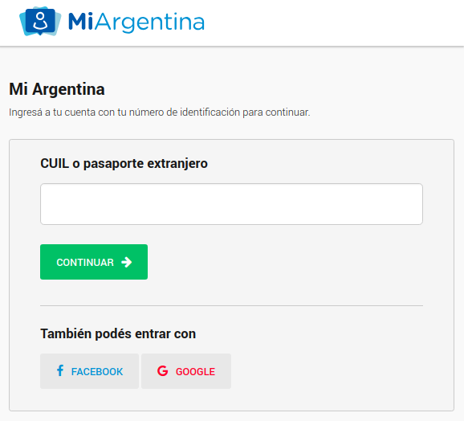

El sistema de autenticación de **Mi Argentina** es un modo **rápido, simple y seguro** de crear cuentas e iniciar sesión en tu aplicación en varias plataformas.
{: class="lead"}

El objetivo es mejorar la experiencia del ciudadano en su contacto con la Administración Pública Nacional (APN) permitiendo acceder desde una misma Identidad Digital a una amplia gama de servicios digitales.

---

## Beneficios

### Validación de identidad

**Mi Argentina** brinda distintos niveles de validación permitiendo que una persona pueda tener una cuenta con identidad validada y acceder a servicios e información sensible.

### Identidad Federada (SSO)

   La autenticación con **Mi Argentina** permite a un usuario estar autenticado en todas las plataformas que usan **Mi Argentina** como sistema de autenticación. Esto permite no tener que iniciar sesión nuevamente en cada plataforma.

### Seguridad

**Mi Argentina** brinda técnicas de protección contra distintos tipos de ataques y vulnerabilidades:
- Protección contra ataques de Cross Site Scripting (XSS)
- Protección de datos sensibles (HTTPS)
- Protección contra redirecciones y reenvíos no validados
- Protección contra Cross Site Request Forgery (CSRF)

---

## Desarrolladores
Conocé más sobre el desarrollo en las distintas plataformas.

1. [Aplicaciones web](doc/plataformas.html#aplicaciones-web)
2. [Android](doc/plataformas.html#android)
3. [iOS y macOS](doc/plataformas.html#ios-y-macos)

---

## OpenID Connect

Hacemos uso del estándar [OpenID Connect 1.0](http://openid.net/connect/) que provee una capa de autenticación por encima del protocolo [OAuth 2.0](https://oauth.net/2/) permitiendo a nuestros clientes verificar la identidad del usuario, así como también obtener información del mismo fácilmente a través de una API REST.
